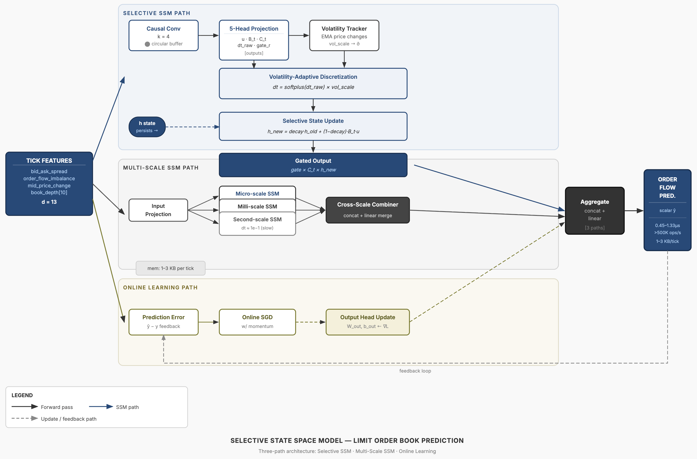

# StreamSSM

**Microsecond-Latency State Space Models for Real-Time Sequential Inference**

## Abstract

State space models (SSMs) achieve O(1) per-step inference through their recurrent formulation, yet existing implementations operate at millisecond latencies due to framework overhead, memory allocation, and cache misses. We present StreamSSM, a C++ SSM inference engine that realizes the theoretical O(1) bound in practice, achieving **0.45–1.33 microsecond** per-step latency with full gradient support.

Our implementation introduces three techniques: (1) a fused selective scan that combines projection, discretization, state update, and gating in a single cache-resident pass, (2) volatility-adaptive discretization where the integration step dt scales with input dynamics, improving stability on non-stationary sequences, and (3) multi-scale state decomposition with learned cross-timescale fusion.

We demonstrate two applications: tick-level financial prediction and LLM KV-cache compression. For KV-cache, the SSM compresses O(seq_len) key-value pairs into O(d_state) fixed-size state, enabling constant-memory attention over arbitrarily long contexts. All models sustain **>500K ops/s** throughput while fitting entirely in L1/L2 cache (1–3KB working set).

## Architecture

