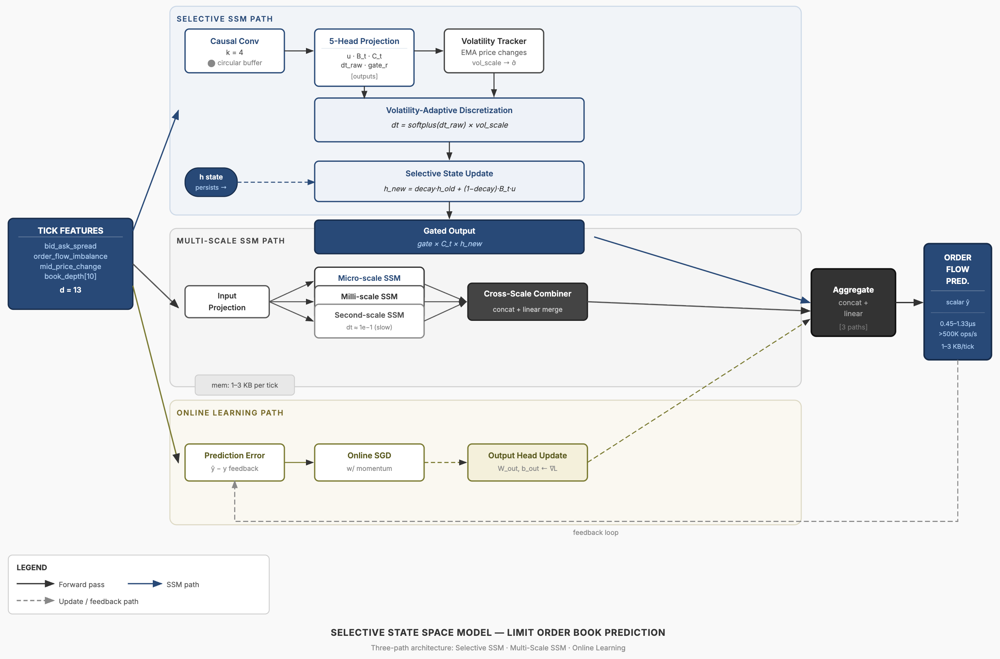

# StreamSSM

**Microsecond-Latency State Space Models for Real-Time Sequential Inference**

## Abstract

The recurrence in state space models is constant-time by definition, but that property only appears in practice if the system is structured around it. Framework-based implementations introduce allocation, scheduling, and memory movement that dominate the cost of the recurrence itself.

StreamSSM is a C++ runtime for streaming SSMs built around a single constraint: minimize per-step latency. The system exposes a `forward_step` interface that processes one input and updates the hidden state in place. Each step executes as a single fused pass with no intermediate tensors and no dynamic allocation in the hot path.

At typical settings (D=32, D_in=13), the working set remains on the order of a few kilobytes, allowing the full update to fit within L1 cache. Per-step latency ranges from **0.67µs to 2.08µs** on CPU, with P50 at **0.75µs**. On GPU, the optimized kernel with warp shuffle reduction achieves **0.574µs** (T4) and **0.217µs** (A100) end-to-end including transfer.

The implementation includes:
- **Selective SSM**: Input-dependent B, C, Δt through a single projection, with volatility-adaptive discretization
- **Multi-scale SSM**: Parallel state updates at different decay rates to capture dynamics at multiple timescales  
- **Online learning**: Lightweight SGD updates to the output head using realized outcomes
- **KV-cache compression**: Fixed-size state representation that compresses O(seq_len) to O(d_state), achieving 40× compression at 8K tokens and 170× at 32K

## Architecture

